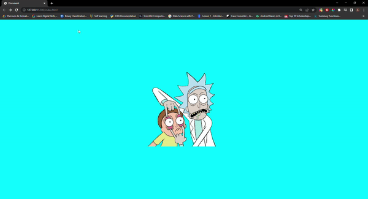

## Eye ball tracking cursor of the user 
This project was made by inpiration from Fireship and https://pocketbase.io/ 
the core objectif of the project is to track the user cursor on the screen 

it was made with vanilla js and html

Feel free to use the code. 💻